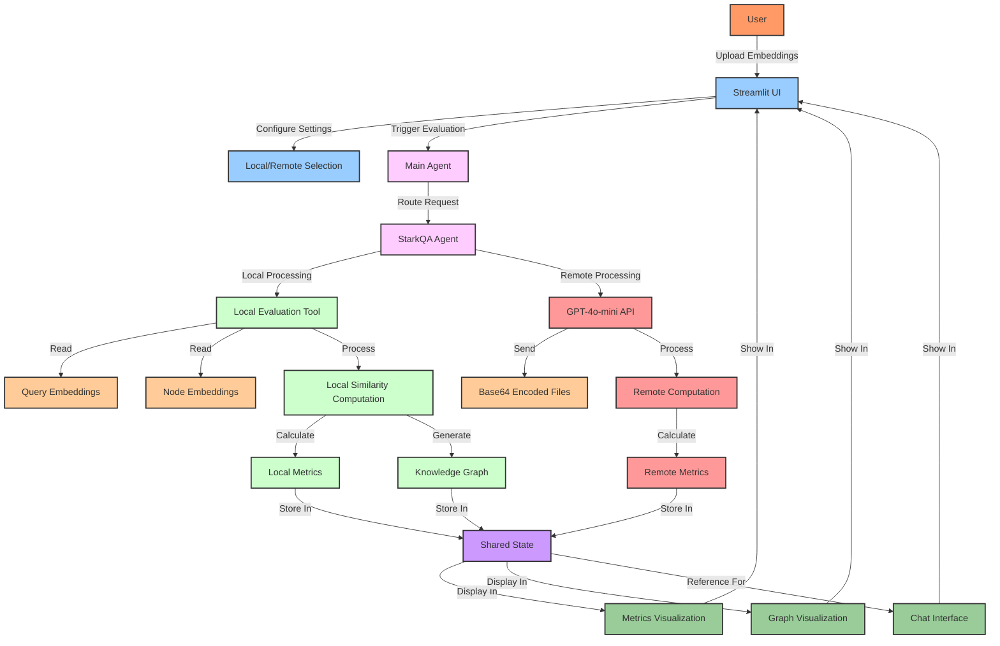
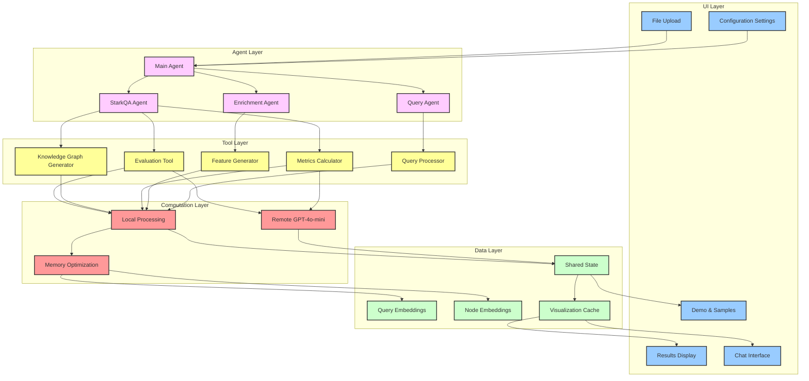
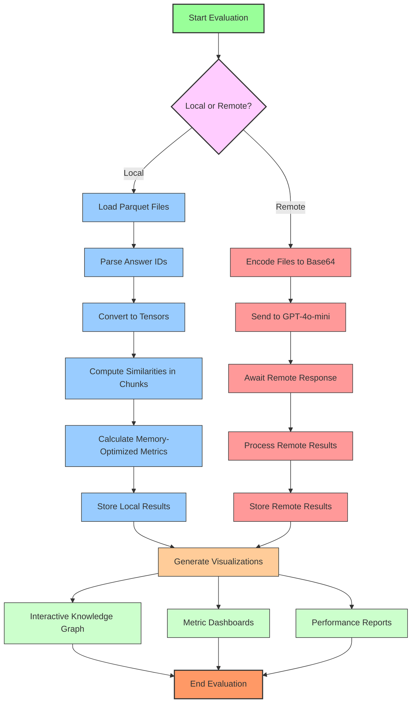
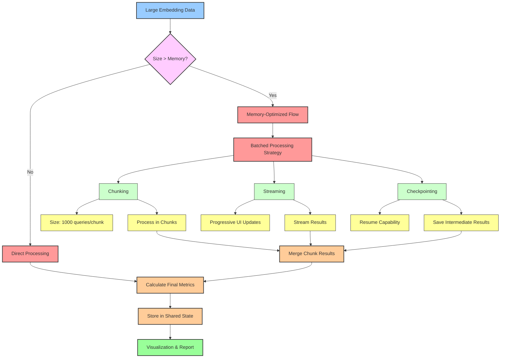
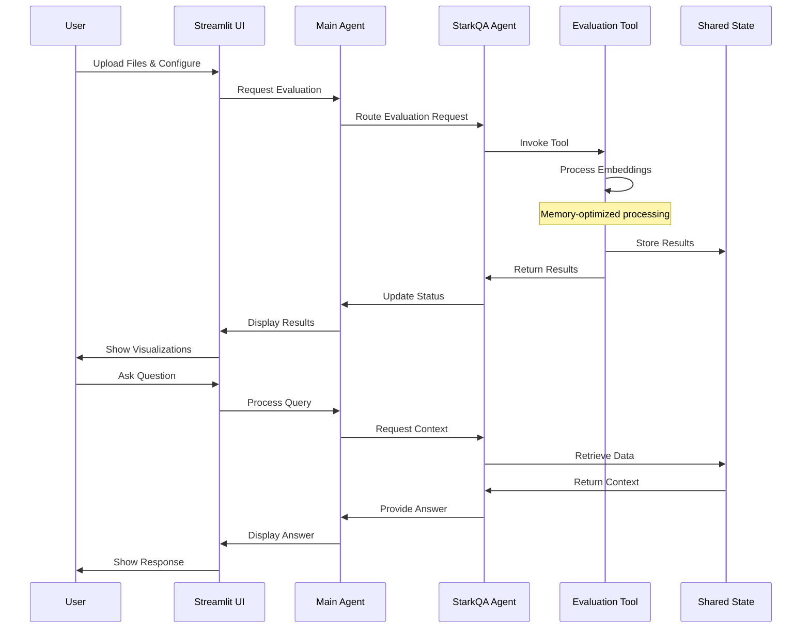

# STaRK Benchmark Evaluation

<p align="center">
  
</p>

<p align="center">
  <strong>A hierarchical agent system for evaluating LLM retrieval performance on semi-structured knowledge bases.</strong>
</p>

<p align="center">
  <a href="#overview">Overview</a> •
  <a href="#features">Features</a> •
  <a href="#architecture">Architecture</a> •
  <a href="#getting-started">Getting Started</a> •
  <a href="#usage">Usage</a> •
  <a href="#evaluation-metrics">Metrics</a> •
  <a href="#why-stark">Why STaRK?</a>
</p>

## 📋 Overview

STaRK (Semi-structured Text and Relational Knowledge) is a comprehensive benchmark designed to evaluate how well large language models (LLMs) and retrieval systems work with semi-structured knowledge bases (SKBs). These knowledge bases combine structured data (e.g., entity relationships) with unstructured data (e.g., textual descriptions), representing real-world knowledge complexity.

This project implements a hierarchical LLM-powered agent system to process, evaluate, and visualize the performance of retrieval systems on the STaRK benchmark, spanning three key domains:

1. **Product Search**: Detailed product metadata, reviews, and relationships
2. **Academic Paper Search**: Paper citations, author relationships, and content
3. **Precision Medicine**: Drug-disease interactions and clinical trial data

## 🌟 Features

- **Hierarchical Agent System**: Multi-agent architecture with specialized agents for different tasks
- **Comprehensive Evaluation**: Calculate standard retrieval metrics (MRR, MAP, NDCG, Recall@K, etc.)
- **Interactive Knowledge Graph**: Visualize node relationships and similarities
- **Streamlit UI**: User-friendly interface for uploading data, running evaluations, and analyzing results
- **Memory Optimization**: Efficiently process large embedding datasets with chunked computation
- **LLM-powered Analysis**: Natural language interface to query and understand results
- **Data Enrichment**: Tools to enhance datasets with additional features
- **Remote Processing**: Support for both local and remote (GPT-4o-mini) evaluation

## 🧠 Architecture

The system implements a hierarchical agent structure:

### Data Flow Diagram with Remote Processing



### Agents

- **Main Agent**: Supervisory agent that routes user queries and orchestrates tasks
- **StarkQA Agent**: Specialized agent focused on evaluation and metrics
- **Query Agent**: Handles natural language queries against the knowledge graph
- **Enrichment Agent**: Provides data enhancement capabilities

### Tools

- **Evaluation Tool**: Processes embeddings and computes similarities
- **Metrics Tool**: Calculates standard retrieval metrics
- **Visualization Tool**: Generates interactive visualizations
- **Knowledge Graph Tool**: Builds and queries the knowledge graph
- **Feature Generation Tool**: Enhances datasets with additional features

## 📊 Evaluation Pipeline

1. **Data Loading**: Process query and node embeddings from parquet files
2. **Similarity Computation**: Calculate similarities between queries and nodes using optimized batching
3. **Metrics Calculation**: Compute standard retrieval metrics (MRR, MAP, Recall@K)
4. **Knowledge Graph Generation**: Create interactive visualizations of node relationships
5. **Result Analysis**: Provide natural language insights about evaluation results

## Memory-Optimized Component Architecture



## 🚀 Getting Started

### Prerequisites

- Python 3.10+
- LangChain/LangGraph
- OpenAI API key (for GPT-4-mini)
- PyTorch
- Streamlit

### Installation

```bash
# Clone the repository
git clone https://github.com/ansh-info/stark-agent
cd stark-agent

# Create and activate virtual environment
python -m venv venv
source venv/bin/activate  # On Windows: venv\Scripts\activate

# Install dependencies
pip install -r requirements.txt

# Set up your OpenAI API key
export OPENAI_API_KEY=your_api_key_here  # On Windows: set OPENAI_API_KEY=your_api_key_here
```

### Running the Application

```bash
# Start the Streamlit app
streamlit run app/demo_app.py
```

## 📝 Usage

1. **Upload Files**:

   - Query Embeddings (parquet format)
   - Node Embeddings (parquet format)

2. **Configure Settings**:

   - Batch Size: Number of queries to process at once
   - Processing Type: Local or Remote (GPT-4o-mini)
   - Evaluation Split: Data split to evaluate on
   - Model Selection: Choose LLM for analysis

3. **Run Evaluation**:

   - Click "Run Evaluation" to start the process
   - Monitor progress in the UI

4. **Analyze Results**:
   - View metrics visualization
   - Explore the knowledge graph
   - Ask questions in natural language

## 📈 Evaluation Metrics

The system calculates and displays the following metrics:

| Metric          | Description                                                                   |
| --------------- | ----------------------------------------------------------------------------- |
| **MRR**         | Mean Reciprocal Rank - Measures where first correct answers appear in ranking |
| **MAP**         | Mean Average Precision - Measures precision across all relevant items         |
| **R-Precision** | Precision at the position equal to number of relevant items                   |
| **Recall@K**    | Proportion of relevant items found in top K results                           |
| **Hit@K**       | Whether any relevant item appears in top K results                            |
| **NDCG**        | Normalized Discounted Cumulative Gain - Evaluates ranking quality             |

## Evaluation Process



## Advanced Memory Optimization Strategy



## 🔍 Knowledge Graph Visualization

The interactive knowledge graph visualization provides:

- **Node Representation**: Entities in the knowledge base
- **Edge Connections**: Similarity relationships between nodes
- **Color Coding**: Visual differentiation of node types
- **Interactive Exploration**: Zoom, pan, and click for details
- **Filtering**: Focus on specific node types or relationship strengths

## 📊 Sample Reports

The system generates comprehensive reports including:

- **Performance Summary**: Key metrics and performance indicators
- **Detailed Analysis**: Breakdown of performance across query types
- **Comparative Metrics**: Comparison against baseline systems
- **Knowledge Graph Insights**: Network analysis of node relationships
- **Recommendations**: Suggestions for system improvement

## 🧩 Project Structure

```
.
├── .env                  # Environment variables
├── agents/
│   ├── __init__.py
│   ├── main_agent.py     # Main supervisory agent
│   └── stark_agent.py    # StarkQA evaluation agent
├── config/
│   └── config.py         # Configuration settings
├── state/
│   └── shared_state.py   # Shared state management
├── tests/
│   ├── __init__.py
│   └── test_stark_evaluation.py
├── tools/
│   ├── __init__.py
│   └── stark/
│       ├── __init__.py
│       └── evaluation_retrival.py  # Core evaluation tool
├── ui/
│   ├── stark_app.py            # Streamlit interface
│   └── demo_app.py
└── utils/
    ├── __init__.py
    └── llm.py            # LLM utilities
```

## 🔬 Why STaRK?

STaRK addresses critical challenges in modern retrieval systems:

1. **Semi-structured Data**: Real-world knowledge bases combine structured and unstructured data
2. **Complex Queries**: Users formulate queries involving multiple relationships and text
3. **Domain Diversity**: Different domains require specialized evaluation approaches

### Target Users

- **ML Engineers**: Evaluating retrieval system performance
- **Researchers**: Benchmarking LLM capabilities on complex knowledge bases
- **Product Teams**: Optimizing search and recommendation systems
- **Domain Experts**: Analyzing domain-specific retrieval effectiveness

### Real-world Applications

- **E-commerce**: Improved product search leveraging reviews and specifications
- **Academic Research**: Enhanced literature search across citation networks
- **Healthcare**: Better drug discovery through relationship analysis
- **Enterprise Search**: More effective information retrieval from corporate knowledge bases

## Agent Communication Pattern



## 🤝 Contributing

We welcome contributions! Please feel free to submit a Pull Request.

1. Fork the repository
2. Create your feature branch (`git checkout -b feature/amazing-feature`)
3. Commit your changes (`git commit -m 'Add some amazing feature'`)
4. Push to the branch (`git push origin feature/amazing-feature`)
5. Open a Pull Request

## 📄 License

This project is licensed under the MIT License - see the LICENSE file for details.

## 🙏 Acknowledgements

- STaRK benchmark creators (Stanford SNAP Group)
- LangChain and LangGraph for agent framework
- Streamlit for the UI framework
- PyTorch and TorchMetrics for evaluation metrics
- OpenAI for GPT-4-mini access
- This project was developed for Team VPE during the Biodatathon - [VirtualPatientEngine/AIAgents4Pharma](https://github.com/VirtualPatientEngine/AIAgents4Pharma)

````markdown
## 📚 Citation

If you use the STaRK Benchmark Suite in your research or project, please cite:

```bibtex
@software{stark_benchmark,
  author = {Kumar, Ansh and Apoorva Gupta},
  title = {STaRK: Benchmarking LLM Retrieval on Semi-structured Knowledge Bases},
  url = {https://github.com/ansh-info/stark-agent},
  year = {2025},
  month = {February},
  note = {STaRK Agent: A hierarchical agent system for evaluating LLM retrieval performance}
}
```
````

## 📞 Contact

For questions or feedback, please open an issue or contact us at [ansh-info@example.com]
