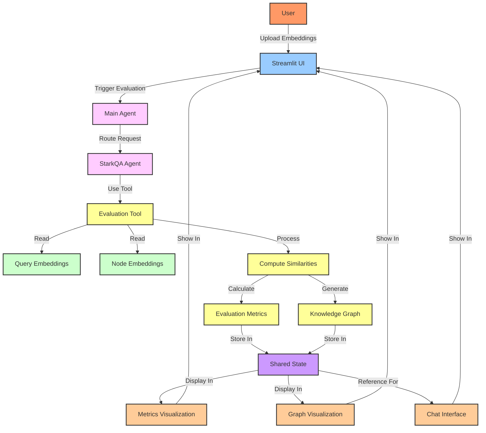
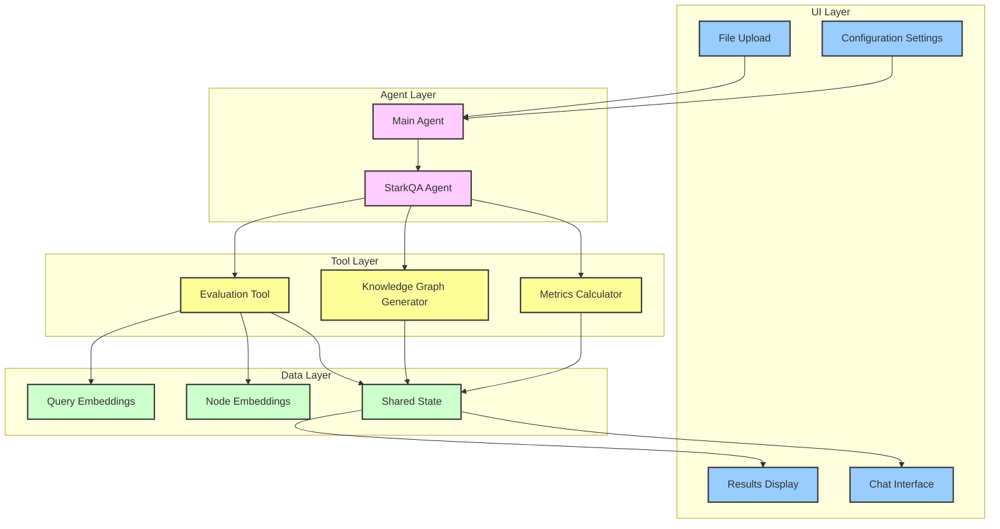
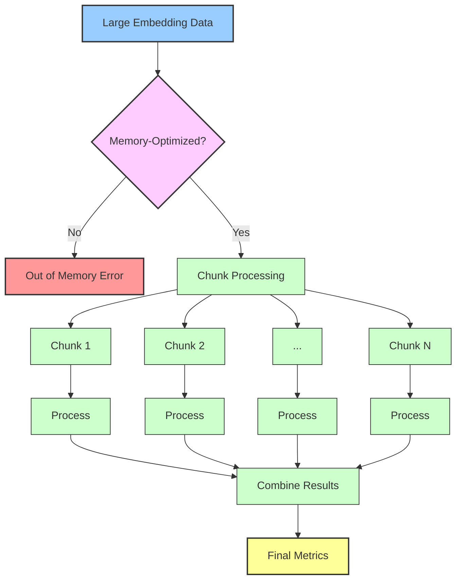

# STaRK Benchmark Evaluation

A hierarchical agent system for evaluating LLM retrieval performance on semi-structured knowledge bases.

## 📋 Overview

STaRK (Semi-structured Text and Relational Knowledge) is a comprehensive benchmark designed to evaluate how well large language models (LLMs) and retrieval systems work with semi-structured knowledge bases (SKBs). This project implements a hierarchical LLM-powered agent system to process, evaluate, and visualize the performance of retrieval systems on the STaRK benchmark.

## Data Flow Diagram



## 🌟 Features

- **Hierarchical Agent System**: Multi-agent architecture with specialized agents for different tasks
- **Comprehensive Evaluation**: Calculate standard retrieval metrics (MRR, MAP, NDCG, Recall@K, etc.)
- **Interactive Knowledge Graph**: Visualize node relationships and similarities
- **Streamlit UI**: User-friendly interface for uploading data, running evaluations, and analyzing results
- **Memory Optimization**: Efficiently process large embedding datasets
- **LLM-powered Analysis**: Natural language interface to query and understand results

## 🧠 Agent Architecture

The system implements a hierarchical agent structure:

- **Main Agent**: Supervisory agent that routes user queries and orchestrates tasks
- **StarkQA Agent**: Specialized agent focused on evaluation tasks
- **Tools**: Specialized functions for evaluation, metrics calculation, and visualization

## 📊 Evaluation Pipeline

1. **Data Loading**: Process query and node embeddings from parquet files
2. **Similarity Computation**: Calculate similarities between queries and nodes
3. **Metrics Calculation**: Compute standard retrieval metrics (MRR, MAP, Recall@K)
4. **Knowledge Graph Generation**: Create interactive visualizations of node relationships
5. **Result Analysis**: Provide natural language insights about evaluation results

## Component Architecture



## 🚀 Getting Started

### Prerequisites

- Python 3.10+
- LangChain/LangGraph
- OpenAI API key (for GPT-4-mini)
- PyTorch
- Streamlit

### Installation

```bash
# Clone the repository
git clone https://github.com/ansh-info/stark-agent.git
cd stark-agent

# Create and activate virtual environment
python -m venv venv
source venv/bin/activate  # On Windows: venv\Scripts\activate

# Install dependencies
pip install -r requirements.txt

# Set up your OpenAI API key
export OPENAI_API_KEY=your_api_key_here  # On Windows: set OPENAI_API_KEY=your_api_key_here
```

### Running the Application

```bash
# Start the Streamlit app
streamlit run app/stark_app.py
```

## 📝 Usage

1. **Upload Files**:

   - Query Embeddings (parquet format)
   - Node Embeddings (parquet format)

2. **Configure Settings**:

   - Batch Size: Number of queries to process at once
   - Processing Chunk Size: Size of data chunks for memory optimization
   - Evaluation Split: Data split to evaluate on

3. **Run Evaluation**:

   - Click "Run Evaluation" to start the process
   - Monitor progress in the UI

4. **Analyze Results**:
   - View metrics visualization
   - Explore the knowledge graph
   - Ask questions in natural language

## 📈 Evaluation Metrics

The system calculates and displays the following metrics:

- **MRR (Mean Reciprocal Rank)**: Measures where first correct answers appear in ranking
- **MAP (Mean Average Precision)**: Measures precision across all relevant items
- **R-Precision**: Precision at the position equal to number of relevant items
- **Recall@K**: Proportion of relevant items found in top K results
- **Hit@K**: Whether any relevant item appears in top K results

## Memory Optimization Strategy



## 🔍 Knowledge Graph Visualization

The interactive knowledge graph shows:

- **Nodes**: Representing entities in the knowledge base
- **Edges**: Showing strong similarity connections
- **Colors**: Differentiating node types
- **Tooltips**: Showing detailed node information

## 🧩 Project Structure

```
.
├── .env                  # Environment variables
├── agents/
│   ├── __init__.py
│   ├── main_agent.py     # Main supervisory agent
│   └── stark_agent.py    # StarkQA evaluation agent
├── config/
│   └── config.py         # Configuration settings
├── state/
│   └── shared_state.py   # Shared state management
├── tests/
│   ├── __init__.py
│   └── test_stark_evaluation.py
├── tools/
│   ├── __init__.py
│   └── stark/
│       ├── __init__.py
│       └── evaluation_retrival.py  # Core evaluation tool
├── app/
│   └── stark_app.py             # Streamlit app
└── utils/
    ├── __init__.py
    └── llm.py            # LLM utilities
```

## 🤝 Contributing

We welcome contributions! Please feel free to submit a Pull Request.

## 📄 License

This project is licensed under the MIT License - see the LICENSE file for details.

## 🙏 Acknowledgements

- STaRK benchmark creators (Stanford SNAP Group)
- LangChain and LangGraph for agent framework
- Streamlit for the UI framework
- PyTorch and TorchMetrics for evaluation metrics
